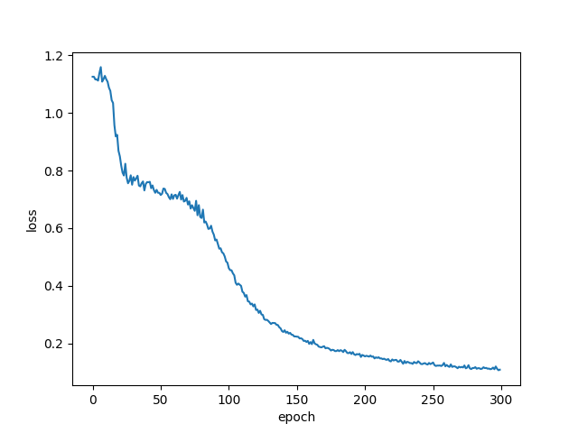
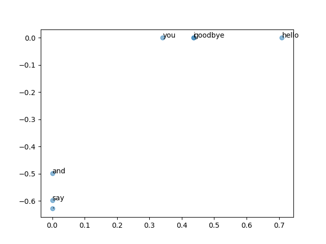

# ゼロから作るDeepLearning2の実装です

## ch01 ニューラルネットワークの復習
3層ニューラルネットワークをnumpyで実装しています

しっかりとlossが収束しました


## ch02 自然言語と単語の分散表現

### 2.3.5 ベクトル間の類似度
'You say goodbye and I say hello.'における  
'you'と'I'の類似度は
```console
0.7071067811865475
```
となりました

### 2.3.6 類似単語のランキング表示
```console
[query] you
 goodbye: 0.7071067811865475
 i: 0.7071067811865475
 hello: 0.7071067811865475
 say: 0.0
 and: 0.0
```

### 2.4.1 相互情報量
正の相互情報量(PPMI)
```console
covariance matrix
[[0 1 0 0 0 0 0]
 [1 0 1 0 1 1 0]
 [0 1 0 1 0 0 0]
 [0 0 1 0 1 0 0]
 [0 1 0 1 0 0 0]
 [0 1 0 0 0 0 1]
 [0 0 0 0 0 1 0]]
--------------------------------------------------
PPMI
[[0.    1.807 0.    0.    0.    0.    0.   ]
 [1.807 0.    0.807 0.    0.807 0.807 0.   ]
 [0.    0.807 0.    1.807 0.    0.    0.   ]
 [0.    0.    1.807 0.    1.807 0.    0.   ]
 [0.    0.807 0.    1.807 0.    0.    0.   ]
 [0.    0.807 0.    0.    0.    0.    2.807]
 [0.    0.    0.    0.    0.    2.807 0.   ]]
```

### 2.4.3 SCDによる次元削減
```console
共起行列：
[0 1 0 0 0 0 0]

PPMI行列：
[0.        1.8073549 0.        0.        0.        0.        0.       ]

SVD：
[ 3.4094876e-01 -1.1102230e-16 -1.2051624e-01 -4.1633363e-16
 -9.3232495e-01 -1.1102230e-16 -2.4257469e-17]
```


### 2.4.4 PTB データセット
```console
Downloading ptb.train.txt ... 
Done
corpus size: 929589
corpus[:30]: [ 0  1  2  3  4  5  6  7  8  9 10 11 12 13 14 15 16 17 18 19 20 21 22 23
 24 25 26 27 28 29]

id_to_word[0]: aer
id_to_word[1]: banknote
id_to_word[2]: berlitz
word_to_id[car] 3856
word_to_id[happy] 4428
word_to_id[lexus] 7426
```