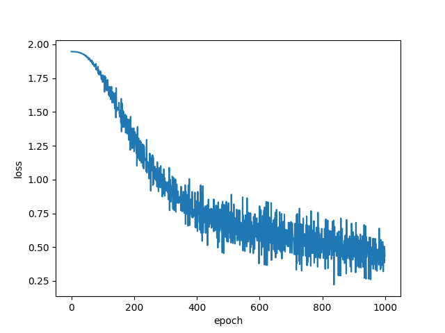

# ゼロから作るDeepLearning2の実装です

# ch01 ニューラルネットワークの復習
3層ニューラルネットワークをnumpyで実装しています

しっかりとlossが収束しました


# ch02 自然言語と単語の分散表現

## 2.3 カウントベースの手法

### 2.3.5 ベクトル間の類似度
'You say goodbye and I say hello.'における  
'you'と'I'の類似度は
```console
0.7071067811865475
```
となりました

### 2.3.6 類似単語のランキング表示
```console
[query] you
 goodbye: 0.7071067811865475
 i: 0.7071067811865475
 hello: 0.7071067811865475
 say: 0.0
 and: 0.0
```

## 2.4 カウントベースの手法の改善

### 2.4.1 相互情報量
正の相互情報量(PPMI)
```console
covariance matrix
[[0 1 0 0 0 0 0]
 [1 0 1 0 1 1 0]
 [0 1 0 1 0 0 0]
 [0 0 1 0 1 0 0]
 [0 1 0 1 0 0 0]
 [0 1 0 0 0 0 1]
 [0 0 0 0 0 1 0]]
--------------------------------------------------
PPMI
[[0.    1.807 0.    0.    0.    0.    0.   ]
 [1.807 0.    0.807 0.    0.807 0.807 0.   ]
 [0.    0.807 0.    1.807 0.    0.    0.   ]
 [0.    0.    1.807 0.    1.807 0.    0.   ]
 [0.    0.807 0.    1.807 0.    0.    0.   ]
 [0.    0.807 0.    0.    0.    0.    2.807]
 [0.    0.    0.    0.    0.    2.807 0.   ]]
```

### 2.4.3 SCDによる次元削減
```console
共起行列：
[0 1 0 0 0 0 0]

PPMI行列：
[0.        1.8073549 0.        0.        0.        0.        0.       ]

SVD：
[ 3.4094876e-01 -1.1102230e-16 -1.2051624e-01 -4.1633363e-16
 -9.3232495e-01 -1.1102230e-16 -2.4257469e-17]
```


### 2.4.4 PTBデータセット
```console
Downloading ptb.train.txt ... 
Done
corpus size: 929589
corpus[:30]: [ 0  1  2  3  4  5  6  7  8  9 10 11 12 13 14 15 16 17 18 19 20 21 22 23
 24 25 26 27 28 29]

id_to_word[0]: aer
id_to_word[1]: banknote
id_to_word[2]: berlitz
word_to_id[car] 3856
word_to_id[happy] 4428
word_to_id[lexus] 7426
```

### 2.4.5 PTBデータセットでの評価
```console
calculating SVD ...

[query] you
 i: 0.7423336505889893
 we: 0.6873364448547363
 'll: 0.5722132921218872
 anybody: 0.5416010022163391
 do: 0.5074149966239929

[query] year
 month: 0.643277645111084
 next: 0.6333162188529968
 quarter: 0.61776202917099
 last: 0.6124981641769409
 june: 0.5761646032333374

[query] car
 luxury: 0.622611403465271
 auto: 0.6135919690132141
 cars: 0.5674763917922974
 corsica: 0.5304152369499207
 truck: 0.5002594590187073

[query] toyota
 motor: 0.6578593254089355
 nissan: 0.6551104784011841
 motors: 0.649016261100769
 lexus: 0.5721182227134705
 honda: 0.5511035919189453
```

# ch03 word2vec
推論ベースの単語の分散表現

## 3.2 シンプルなword2vec
Continuous Bag-Of-Words (CBOW)のモデルを使用

## 3.4 CBOWのモデルの実装

lossが収束した

```console
you [ 1.2040255  -0.95433366 -1.0362948   0.9855163   1.6463662 ]
say [-0.38827032  1.3821114   0.82578325 -0.32687727  1.2684182 ]
goodbye [ 0.5629739  -1.1946024  -1.0616726   0.95563424 -0.13099802]
and [1.3838872  1.301099   1.4869303  1.3906974  0.74316263]
i [ 0.570322   -1.1694691  -1.0845531   0.9161677  -0.12771983]
hello [ 1.2095406 -0.9624783 -1.0294889  0.9782053  1.6491066]
. [-1.2511857  1.07652   -1.455063  -1.2598689  1.2311668]
```
単語を密なベクトルで表すことができたが、コーパスが小さすぎる